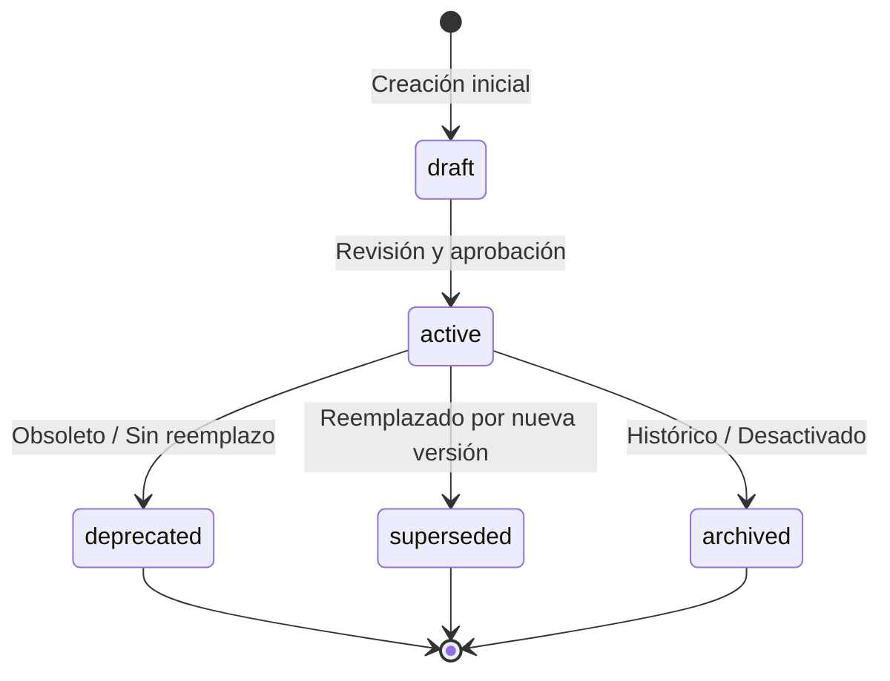

# Document Lifecycle Workflows

Guía operativa para gestionar el ciclo de vida y el estado de verdad de los documentos según [`meta/lifecycle.md`](/meta/lifecycle.md).

---

## 1. Máquina de Estados

Los documentos progresan a lo largo de un ciclo lineal. Una vez que un documento abandona el estado `active`, entra en un estado terminal y **no debe volver a consultarse como fuente de verdad**.

---

## 2. Estados y Fuente de Verdad

| Estado | Significado | ¿Es Fuente de Verdad? | Regla para Agentes y Humanos |
|---|---|:---:|---|
| `draft` | Trabajo en progreso, no finalizado. | ⚠️ No | Debe validarse su aplicabilidad antes de tomarlo como base. |
| `active` | Documento vigente, revisado y actual. | ✅ **SÍ** | **Única fuente de verdad canónica**. Seguir sus directrices al 100%. |
| `deprecated` | Obsoleto o ya no válido. | ❌ No | Ignorar para nuevas implementaciones. Debe tener `deprecatedReason`. |
| `superseded` | Reemplazado formalmente por otro doc. | ❌ No | Ignorar este archivo y saltar al indicado en `supersededBy`. |
| `archived` | Retirado por motivos históricos. | ❌ No | Ignorar para el desarrollo actual. |

---

## 3. Reglas de Transición y Campos Requeridos

### A. De `draft` a `active`
- Ocurre cuando el documento está completo, revisado y aprobado.
- Requiere:
  1. `status: active`
  2. `updated: <ISO-DATE>` (ej. `2026-09-05`)
  3. `expires: <ISO-DATE>` (opcional o recomendado para fijar ventana de revisión, ej. 1 año).

### B. De `active` a `deprecated`
- Ocurre cuando una funcionalidad, convención o decisión deja de ser válida y no existe un reemplazo directo.
- Requiere:
  1. `status: deprecated`
  2. `updated: <ISO-DATE>`
  3. `deprecatedReason: "<Motivo claro y conciso de la desaprobación>"` (OBLIGATORIO).

### C. De `active` a `superseded`
- Ocurre cuando una nueva decisión o arquitectura reemplaza integralmente a la existente.
- Requiere:
  1. `status: superseded`
  2. `updated: <ISO-DATE>`
  3. `deprecatedReason: "<Motivo por el cual fue reemplazado>"` (OBLIGATORIO).
  4. `supersededBy: "/ruta/absoluta/al/nuevo_documento.md"` (OBLIGATORIO).

### D. De `active` a `archived`
- Ocurre cuando el contenido ya no tiene impacto operativo (por ejemplo, un roadmap de una etapa ya concluida).
- Requiere:
  1. `status: archived`
  2. `updated: <ISO-DATE>`

---

## 4. Auditoría de Expiración (`expires`)

- Si la fecha actual es posterior a `expires`, el documento se considera **estancado/vencido** (*stale*).
- Los agentes que detecten un documento vencido deben advertir al usuario o proponer una revisión para renovar `expires` o cambiarlo al estado correspondiente.
