# Diagrama ER de COPAS (v2)

DER de la base de datos de COPAS. Análisis que originó esta versión:
[der_analisis.md](der_analisis.md).

Las tablas de autenticación y organización (`user`, `account`, `session`,
`verification`, `organization`, `member`, `invitation`) son **gestionadas por
better-auth**: se representan como stubs (solo `id`) y solo aparecen para
marcar relaciones. Su estructura real la define el framework.

```mermaid
erDiagram
    user {
        text id PK
    }

    organization {
        text id PK
    }

    plans {
        text id PK
        text code UK
        text name
        decimal price
        text currency
        text interval
        json limits
        timestamp created_at
        timestamp updated_at
        timestamp deleted_at
    }

    plan_versions {
        text id PK
        text plan_id FK
        integer version
        text name
        decimal price
        text currency
        text interval
        json limits
        timestamp created_at
        timestamp updated_at
        timestamp deleted_at
    }

    features {
        text id PK
        text code UK
        text name
        text description
        timestamp created_at
        timestamp updated_at
        timestamp deleted_at
    }

    plan_version_features {
        text plan_version_id PK,FK
        text feature_id PK,FK
        integer feature_limit
        boolean is_enabled
        timestamp created_at
        timestamp updated_at
        timestamp deleted_at
    }

    subscriptions {
        text id PK
        text organization_id FK
        text plan_version_id FK
        text status
        decimal price_amount
        text currency
        date period_start
        date period_end
        timestamp created_at
        timestamp updated_at
        timestamp deleted_at
    }

    subscription_feature_overrides {
        text subscription_id PK,FK
        text feature_id PK,FK
        integer override_limit
        boolean is_enabled
        timestamp created_at
        timestamp updated_at
        timestamp deleted_at
    }

    subscription_payments {
        text id PK
        text organization_id FK
        text subscription_id FK
        decimal amount
        text currency
        text status
        text gateway_transaction_id
        timestamp payment_date
        timestamp created_at
        timestamp updated_at
        timestamp deleted_at
    }

    companies {
        text id PK
        text code UK
        text name
        timestamp created_at
        timestamp updated_at
        timestamp deleted_at
    }

    branches {
        text id PK
        text code UK
        text name
        timestamp created_at
        timestamp updated_at
        timestamp deleted_at
    }

    asset_types {
        text id PK
        text branch_id FK
        text code
        text name
        json property_definition
        timestamp created_at
        timestamp updated_at
        timestamp deleted_at
    }

    payment_methods {
        text id PK
        text code UK
        text name
        timestamp created_at
        timestamp updated_at
        timestamp deleted_at
    }

    insureds {
        text id PK
        text organization_id FK
        text uploaded_by FK
        text cuit
        text full_name
        text phone
        text email
        date birth_date
        timestamp created_at
        timestamp updated_at
        timestamp deleted_at
    }

    assets {
        text id PK
        text insured_id FK
        text asset_type_id FK
        text uploaded_by FK
        text external_reference
        json properties
        timestamp created_at
        timestamp updated_at
        timestamp deleted_at
    }

    policies {
        text id PK
        text organization_id FK
        text company_id FK
        text insured_id FK
        text payment_method_id FK
        text uploaded_by FK
        text produced_by FK
        text policy_number
        decimal premium_total
        text currency
        date start_date
        date end_date
        date effective_end_date
        text status
        text billing_frequency
        text document_url
        timestamp created_at
        timestamp updated_at
        timestamp deleted_at
    }

    policy_assets {
        text policy_id PK,FK
        text asset_id PK,FK
        timestamp created_at
        timestamp updated_at
        timestamp deleted_at
    }

    policy_coverages {
        text id PK
        text policy_id FK
        json data
        timestamp created_at
        timestamp updated_at
        timestamp deleted_at
    }

    policy_installments {
        text id PK
        text organization_id FK
        text policy_id FK
        text uploaded_by FK
        integer installment_number
        date due_date
        decimal total_amount
        text currency
        text status
        text receipt_url
        timestamp created_at
        timestamp updated_at
        timestamp deleted_at
    }

    ai_extraction_results {
        text id PK
        text policy_id FK
        text status
        json result
        json corrections
        text reviewed_by FK
        timestamp reviewed_at
        text model
        timestamp created_at
        timestamp updated_at
        timestamp deleted_at
    }

    reminder_rules {
        text id PK
        text organization_id FK
        text event_source
        integer offset_days
        text template_id FK
        boolean is_enabled
        timestamp created_at
        timestamp updated_at
        timestamp deleted_at
    }

    channels {
        text id PK
        text code UK
        text name
        text description
        boolean is_system
        timestamp created_at
        timestamp updated_at
        timestamp deleted_at
    }

    channel_endpoints {
        text id PK
        text channel_id FK
        text number
        text provider
        text owner_kind
        text owner_organization_id FK
        text status
        timestamp created_at
        timestamp updated_at
        timestamp deleted_at
    }

    organization_integrations {
        text id PK
        text organization_id FK
        text provider
        text status
        json credentials
        json config
        timestamp created_at
        timestamp updated_at
        timestamp deleted_at
    }

    organization_channels {
        text id PK
        text organization_id FK
        text channel_id FK
        text integration_id FK
        boolean is_enabled
        json config
        timestamp created_at
        timestamp updated_at
        timestamp deleted_at
    }

    organization_channel_endpoints {
        text id PK
        text organization_channel_id FK
        text endpoint_id FK
        text label
        boolean is_primary
        text status
        timestamp assigned_at
        timestamp created_at
        timestamp updated_at
        timestamp deleted_at
    }

    communication_categories {
        text id PK
        text code UK
        text name
        boolean is_mandatory
        timestamp created_at
        timestamp updated_at
        timestamp deleted_at
    }

    message_templates {
        text id PK
        text channel_id FK
        text category_id FK
        text code UK
        text name
        text subject
        text body
        json variables
        boolean is_system_base
        timestamp created_at
        timestamp updated_at
        timestamp deleted_at
    }

    organization_message_templates {
        text organization_id PK,FK
        text template_id PK,FK
        boolean is_enabled
        json custom_overrides
        timestamp created_at
        timestamp updated_at
        timestamp deleted_at
    }

    organization_notification_preferences {
        text organization_id PK,FK
        text category_id PK,FK
        boolean is_enabled
        timestamp created_at
        timestamp updated_at
        timestamp deleted_at
    }

    communication_consents {
        text organization_id PK,FK
        text insured_id PK,FK
        text category_id PK,FK
        boolean is_opted_out
        timestamp opt_out_at
        text opt_out_reason
        timestamp created_at
        timestamp updated_at
        timestamp deleted_at
    }

    notification_campaigns {
        text id PK
        text organization_id FK
        text campaign_origin
        text name
        text type
        json metadata
        timestamp created_at
        timestamp updated_at
        timestamp deleted_at
    }

    system_notifications {
        text id PK
        text organization_id FK
        text channel_id FK
        text template_id FK
        text campaign_id FK
        text recipient_user_id FK
        text recipient_address
        text content
        text status
        timestamp sent_at
        timestamp created_at
        timestamp updated_at
        timestamp deleted_at
    }

    system_notification_statuses {
        text id PK
        text system_notification_id FK
        text status
        timestamp occurred_at
        json details
        timestamp created_at
    }

    conversations {
        text id PK
        text organization_id FK
        text organization_channel_endpoint_id FK
        text insured_id FK
        text campaign_id FK
        text type
        text subject
        text status
        json metadata
        timestamp created_at
        timestamp updated_at
        timestamp deleted_at
    }

    conversation_participants {
        text id PK
        text conversation_id FK
        text user_id FK
        text insured_id FK
        timestamp joined_at
        timestamp created_at
        timestamp updated_at
        timestamp deleted_at
    }

    conversation_entities {
        text id PK
        text conversation_id FK
        text policy_id FK
        text insured_id FK
        text installment_id FK
        text linked_by FK
        timestamp linked_at
        timestamp created_at
    }

    messages {
        text id PK
        text conversation_id FK
        text organization_id FK
        text template_id FK
        text direction
        text sender_kind
        text sender_user_id FK
        text sender_insured_id FK
        text content
        text deduplication_hash UK
        timestamp sent_at
        json metadata
        timestamp created_at
        timestamp updated_at
        timestamp deleted_at
    }

    message_statuses {
        text id PK
        text message_id FK
        text status
        timestamp occurred_at
        json details
        timestamp created_at
    }

    %% Billing SaaS
    plans ||--o{ plan_versions : "has versions"
    plan_versions ||--o{ plan_version_features : "defines"
    features ||--o{ plan_version_features : "included in"
    plan_versions ||--o{ subscriptions : "contracted as"
    organization ||--o{ subscriptions : "subscribes"
    subscriptions ||--o{ subscription_feature_overrides : "may override"
    features ||--o{ subscription_feature_overrides : "referenced in"
    subscriptions ||--o{ subscription_payments : "generates"
    organization ||--o{ subscription_payments : "pays"

    %% Dominio asegurador
    companies ||--o{ policies : "issues"
    branches ||--o{ asset_types : "groups"
    asset_types ||--o{ assets : "defines"
    payment_methods ||--o{ policies : "paid with"
    organization ||--o{ insureds : "administers"
    user ||--o{ insureds : "uploads"
    insureds ||--o{ assets : "owns"
    user ||--o{ assets : "uploads"
    insureds ||--o{ policies : "holds"
    organization ||--o{ policies : "administers"
    user ||--o{ policies : "uploads"
    user ||--o{ policies : "produces"
    policies ||--|{ policy_assets : "covers"
    assets ||--o{ policy_assets : "included in"
    policies ||--o{ policy_coverages : "has coverage"
    policies ||--o{ policy_installments : "divided into"
    organization ||--o{ policy_installments : "administers"
    user ||--o{ policy_installments : "uploads"
    policies ||--o{ ai_extraction_results : "analyzed by"
    user ||--o{ ai_extraction_results : "reviews"
    organization ||--o{ reminder_rules : "configures"
    message_templates ||--o{ reminder_rules : "uses"

    %% Comunicaciones
    channels ||--o{ channel_endpoints : "has"
    organization ||--o{ channel_endpoints : "may own"
    organization ||--o{ organization_integrations : "connects"
    channels ||--o{ organization_channels : "enables"
    organization ||--o{ organization_channels : "configures"
    organization_integrations ||--o{ organization_channels : "used by"
    organization_channels ||--o{ organization_channel_endpoints : "assigns"
    channel_endpoints ||--o{ organization_channel_endpoints : "used in"
    channels ||--o{ message_templates : "has"
    communication_categories ||--o{ message_templates : "categorizes"
    message_templates ||--o{ organization_message_templates : "assigned to"
    organization ||--o{ organization_message_templates : "configures"
    communication_categories ||--o{ organization_notification_preferences : "configured in"
    channels ||--o{ organization_notification_preferences : "configured in"
    organization ||--o{ organization_notification_preferences : "defines"
    communication_categories ||--o{ communication_consents : "applies to"
    insureds ||--o{ communication_consents : "grants"
    organization ||--o{ communication_consents : "manages"
    organization ||--o{ notification_campaigns : "launches"
    notification_campaigns ||--o{ system_notifications : "groups"
    notification_campaigns ||--o{ conversations : "groups"
    organization ||--o{ system_notifications : "receives"
    channels ||--o{ system_notifications : "uses system channel"
    message_templates ||--o{ system_notifications : "renders"
    user ||--o{ system_notifications : "notified"
    system_notifications ||--o{ system_notification_statuses : "tracks"
    organization ||--o{ conversations : "has"
    organization_channel_endpoints ||--o{ conversations : "hosts"
    insureds ||--o{ conversations : "participates"
    conversations ||--o{ conversation_participants : "includes"
    user ||--o{ conversation_participants : "joins"
    insureds ||--o{ conversation_participants : "joins"
    conversations ||--o{ conversation_entities : "links"
    policies ||--o{ conversation_entities : "linked"
    insureds ||--o{ conversation_entities : "linked"
    policy_installments ||--o{ conversation_entities : "linked"
    user ||--o{ conversation_entities : "links"
    conversations ||--o{ messages : "contains"
    organization ||--o{ messages : "sends"
    message_templates ||--o{ messages : "renders"
    user ||--o{ messages : "authors"
    insureds ||--o{ messages : "authors"
    messages ||--o{ message_statuses : "tracks"
```

## Convenciones del modelo

- **Naming**: tablas de dominio en plural `snake_case`. Las de better-auth conservan
  el naming del framework. Los nombres físicos se fijan en Drizzle.
- **IDs**: `text` generados en aplicación (UUID v7).
- **Timestamps** (`created_at`, `updated_at`, `sent_at`, `occurred_at`, `paid_at`,
  `assigned_at`, `joined_at`, `linked_at`, `reviewed_at`, `opt_out_at`):
  instantes en **UTC, epoch ms** (Drizzle `timestamp_ms`, coherente con `auth-db`).
  La presentación y el cómputo de "hoy" del scheduler se hacen en
  `America/Argentina/Buenos_Aires` (UTC-3 fijo, sin DST) en capa de aplicación.
  **Nunca se guarda hora local.**
- **Fechas civiles** (`date`): `due_date`, `birth_date`, `start_date`, `end_date`,
  `effective_end_date`, `period_start`, `period_end`. Un día calendario, no un
  instante. Implementación: texto ISO `YYYY-MM-DD` sin timezone.
- **`boolean`**: conceptual; implementación integer 0/1 + `CHECK`.
- **`decimal`**: dinero con 2 decimales, `decimal(12,2)` conceptual. Implementación
  en SQLite: integer en centavos o texto decimal exacto (nunca REAL/float).
- **`currency`**: ISO 4217, default `'ARS'`. Presente en toda tabla con montos.
- **`json`**: texto JSON validado (`json_valid`) + validación de forma en aplicación.
- **Trazabilidad unificada**: todas las entidades de dominio llevan `created_at`,
  `updated_at`, `deleted_at` (soft-delete). Tablas de carga de dominio llevan
  `uploaded_by` (quién registró); `policies.produced_by` es el PAS productor.
- **Logs de eventos** (`*_statuses`) y tablas de vínculo instantáneo
  (`conversation_entities`) llevan solo `created_at`: son inmutables.

## Regla de negocio: notificaciones vs conversaciones

- **`system_notifications`**: comunicación **unidireccional** del sistema hacia la
  organización (auth, billing, avisos internos del SaaS). Se envían por **canales del
  sistema** (`ui`, `email`, `sms`, `whatsapp`), propiedad de la plataforma: la org **no configura
  el canal**, solo decide **si recibe o no** cada categoría
  (`organization_notification_preferences` por `(organization_id, category_id)`).
  Destinatario: siempre un `user` (miembro de la org).
- **`conversations` + `messages`**: toda comunicación **bidireccional**, externa
  (asegurados) o interna. El canal **sí es elegible por la org** (vía
  `organization_channels`), siendo **WhatsApp el canal bidireccional predilecto**.
  **Las alertas de vencimiento y renovación se envían siempre como conversación**
  (mensaje con `sender_kind = 'system'`, `direction = 'outbound'`), generadas por el
  scheduler según `reminder_rules` y agrupadas por `conversations.campaign_id`.
- `deduplication_hash` (UK por organización) vive en `messages`: es donde existe
  riesgo real de envío duplicado. Garantiza idempotencia del scheduler.

## Constraints e índices declarados

**PKs compuestas** (joins no referenciadas por terceros):
`plan_version_features (plan_version_id, feature_id)`,
`subscription_feature_overrides (subscription_id, feature_id)`,
`policy_assets (policy_id, asset_id)`,
`organization_message_templates (organization_id, template_id)`,
`organization_notification_preferences (organization_id, category_id)`,
`communication_consents (organization_id, insured_id, category_id)`.

**UKs compuestas**:
`plan_versions (plan_id, version)`,
`asset_types (branch_id, code)`,
`insureds (organization_id, cuit)`,
`policies (organization_id, company_id, policy_number)`,
`organization_channels (organization_id, channel_id)`,
`organization_channel_endpoints (organization_channel_id, endpoint_id)`,
`conversations (id, organization_id)`,
`message_templates (id, channel_id)`,
`messages (organization_id, deduplication_hash)`.

**UKs parciales**:
`subscriptions (organization_id) WHERE status = 'active'` (una suscripción activa
por org); `organization_channel_endpoints (organization_channel_id)
WHERE is_primary` (un solo primario);
`organization_channel_endpoints (endpoint_id) WHERE status = 'active'` (un endpoint
no se asigna activo a dos orgs a la vez).

**FKs compuestas**:
- *Invariante canal/template (`system_notifications`)*: `message_templates` declara
  `UK (id, channel_id)`; `system_notifications` referencia `(template_id, channel_id)`
  contra esa UK — el template usado pertenece al **canal del sistema** por el que se
  envía. La categoría se deriva del template (no se duplica en notifications ni
  messages).
- *Same-tenant (`messages`)*: `messages` referencia `(conversation_id,
  organization_id)` contra `conversations UK (id, organization_id)` — el tenant del
  mensaje no puede divergir del de su conversación.

**Scope de canales** (regla de aplicación, no constraint): `system_notifications`
solo usa canales con `is_system = true` (`ui`, `email`, `sms`);
`organization_channels` solo referencia canales con `is_system = false` (`whatsapp`).

**Derivación de canal en `messages`**: `messages` **no** almacena canal ni endpoint;
se derivan siempre de su conversación (`conversation → organization_channel_endpoint
→ organization_channel → channel`). Por eso el invariante "template.channel = canal
de la conversación" no es enforceable por FK sin denormalizar: se enforcea en la
**capa de servicio** al renderizar (la conversación determina el canal; el template
debe pertenecer a él) y queda cubierto por la cadena de resolución de envío.

**CHECKs**: enums (valores de §Enums), booleanos en {0,1}, `json_valid` en columnas
`json`, y cardinalidad de FKs nullable:
- `conversation_participants`: exactamente uno de `user_id` / `insured_id`.
- `messages`: coherencia `sender_kind` ↔ (`sender_user_id` | `sender_insured_id` |
  ninguno para `system`/`agent`).
- `conversation_entities`: exactamente uno de `policy_id` / `insured_id` /
  `installment_id`.
- `channel_endpoints`: `owner_kind = 'organization'` ↔ `owner_organization_id`
  NOT NULL; `'platform'` ↔ NULL.

**Índices** (además de uno por cada FK):
`policy_installments (status)` — filtro del scheduler de vencimientos;
`policy_installments (due_date)`; `messages (conversation_id, sent_at)`;
`system_notifications (organization_id, status)`.

**Cadena de resolución de envío** (proceso, no constraint): `(org, category)`
habilitado en `organization_notification_preferences` → template asignado y
habilitado en `organization_message_templates` para esa `(category, channel)` →
si no existe, registrar envío con `status = 'skipped'`. En `system_notifications`
el canal es un canal del sistema (`is_system = true`); en `messages` es el canal de
la conversación.

## Enums por tabla

| Tabla | Campo | Valores |
|---|---|---|
| `organization_integrations` | `provider` | `whatsapp_cloud`, `email_service` |
| `organization_integrations` | `status` | `active`, `pending`, `error`, `disabled` |
| `plans`, `plan_versions` | `interval` | `month`, `quarter`, `year` |
| `subscriptions` | `status` | `active`, `past_due`, `canceled`, `expired` |
| `subscription_payments` | `status` | `pending`, `paid`, `failed`, `refunded` |
| `policies` | `status` | `active`, `overdue`, `expired`, `renewed`, `canceled` |
| `policies` | `billing_frequency` | `monthly`, `bimonthly`, `quarterly`, `semiannual`, `annual`, `single_payment` |
| `policy_installments` | `status` | `pending`, `paid`, `overdue` |
| `notification_campaigns` | `campaign_origin` | `system`, `manual`, `scheduled` |
| `notification_campaigns` | `type` | `renewal_reminder`, `installment_due`, `payment_confirmation`, `custom` |
| `system_notifications`, `system_notification_statuses` | `status` | `pending`, `sent`, `delivered`, `read`, `failed`, `skipped` |
| `conversations` | `type` | `reminder`, `renewal`, `inquiry`, `general` |
| `conversations` | `status` | `open`, `pending`, `closed` |
| `messages` | `direction` | `inbound`, `outbound` |
| `messages` | `sender_kind` | `user`, `insured`, `system`, `agent` |
| `message_statuses` | `status` | `sent`, `delivered`, `read`, `failed`, `received` |
| `channel_endpoints` | `provider` | `whatsapp_cloud`, `email_service` |
| `channel_endpoints` | `status` | `active`, `inactive`, `released` |
| `channel_endpoints` | `owner_kind` | `platform`, `organization` |
| `organization_channel_endpoints` | `status` | `active`, `suspended`, `released` |
| `ai_extraction_results` | `status` | `pending`, `processing`, `on_review`, `approved`, `approved_with_corrections`, `failed` |
| `reminder_rules` | `event_source` | `installment_due`, `policy_expiration` |

Notas:
- `policies.effective_end_date` (nullable): fin **real** de la cobertura (mora, baja,
  venta del asset). Cobertura efectiva = `start_date → COALESCE(effective_end_date,
  end_date)`.
- `ai_extraction_results.corrections` registra qué campos se corrigieron cuando
  `status = 'approved_with_corrections'`; `reviewed_by`/`reviewed_at` trazan la
  revisión humana.
- Catálogos (filas con `code` UK, no enums): `channels`, `companies`, `branches`,
  `payment_methods`, `communication_categories`, `features`, `plans`,
  `message_templates`, `asset_types (branch_id, code)`.
- `channels` distingue scope con `is_system`: canales del sistema (`ui`, `email`,
  `sms` → `true`, propiedad de la plataforma) vs canales de tenant (`whatsapp` →
  `false`, configurables por la org vía `organization_channels`).
- `payment_methods` es catálogo global mínimo (`id`, `code`, `name`): solo se
  registra el método elegido por póliza, no se procesan pagos con él.
