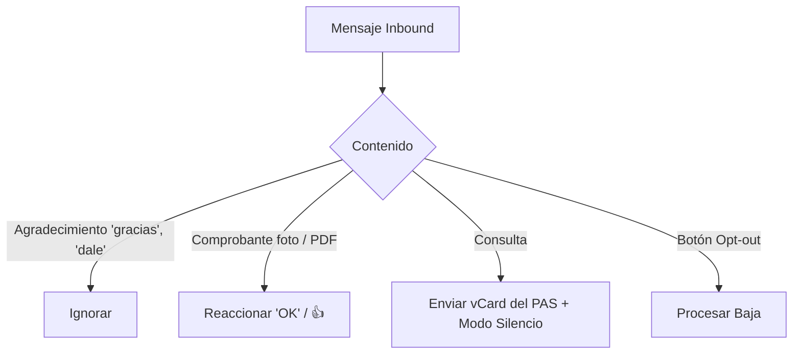

# Decisión: Triage de Inbound WhatsApp

Reglas de interacción automatizada y triage para mensajes entrantes por WhatsApp.

## 1. Asegurados Registrados

Al recibir un mensaje de un asegurado registrado (`insureds.phone` o BSUID vinculado):



1. **Agradecimiento ("gracias", "dale", "ok")**: Se persiste en el historial; no se emite respuesta saliente para evitar costos y fatiga.
2. **Comprobante de Pago (foto / PDF)**: Se reacciona con "OK" (o emoji 👍) y se deja listo para conciliación.
3. **Consulta General**: Se responde aclarando que el canal es exclusivo para recordatorios y se envía la tarjeta de contacto (vCard) del PAS asignado. A partir de allí, el sistema entra en **modo silencio** (ignora mensajes posteriores de ese asegurado hasta que se despache un nuevo recordatorio programado).

## 2. No Registrados (WhatsApp Flows)

Mensajes de números no vinculados a pólizas activas se procesan con **WhatsApp Flows**:

1. **Flow de Informe de Pago**: Solicita CUIT o Patente; si concilia póliza, asocia el pago a la agencia detectada y pasa la cuota a `paid`.
2. **Flow de Consulta / Prospecto**: Formulario simple de datos básicos; si no concilia póliza con ninguna agencia, la conversación se persiste en D1 bajo la organización de sistema (`PLATFORM_SYSTEM_ORG_ID`) para ser preservada y referida como prospecto a agencias, cerrando la interacción interactiva (`status = 'closed'`).
3. **Descarte Posterior**: Mensajes posteriores de ese número tras el cierre se descartan a nivel backend para evitar costos de Meta.

## 3. Opt-out y Vista en Base de Datos

- **Activación Exclusiva por Botón**: El opt-out se ejecuta únicamente mediante la pulsación del botón interactivo de baja provisto en los mensajes (no se procesan palabras libres).
- **Registro**: `api` asienta `communication_consents.isOptedOut = true` y envía confirmación.
- **Vista D1 para Consultas**: Se define la vista SQL `v_active_consents` para evaluar el estado de consentimiento de forma directa y optimizada:
  ```sql
  CREATE VIEW v_active_consents AS
  SELECT organizationId, insuredId, categoryId, isOptedOut
  FROM communication_consents;
  ```
  `scheduler` y `api` consultan esta vista antes de encolar; si `isOptedOut = 1`, se omite el envío con `status = 'skipped'`.

## Ver también

- [Whatsapp Service](/docs/comunicaciones/whatsapp/servicio.md)
- [WhatsApp Service Worker](/src/docs/comunicaciones/whatsapp/service.md)
- [WhatsApp Inbound Pipeline](/src/docs/comunicaciones/whatsapp/inbound-pipeline.md)
- [Topología de Servicios](/docs/arquitectura/topologia_de_servicios.md)
