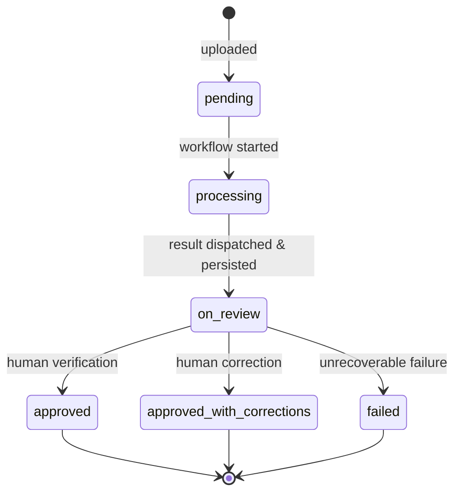

# AI Service

Asynchronous policy extraction service backed by Cloudflare Workflows, Mistral OCR, and Cloudflare Workers AI.

## Topology

| Component | Responsibility |
|---|---|
| Web Client | Direct upload of document binary to R2 via signed upload URL |
| API | Ingestion coordinator, presigned read URL generation, domain persistence |
| Storage (R2) | Raw document binary repository |
| Inbound Queue (`copas-ai-extraction`) | Buffers extraction requests from API to Extractor |
| Extractor Worker | Queue consumer that instantiates durable workflow executions |
| Extraction Workflow (`PolicyExtractionWorkflow`) | Durable orchestrator for OCR and LLM normalization steps |
| Mistral OCR | Optical character recognition service (`mistral-ocr-latest`) |
| Workers AI | Structured data normalization (`@cf/google/gemma-4-26b-a4b-it`) |
| Outbound Queue (`copas-ai-result`) | Delivers structured policy payloads back to API |
| Database (D1) | Domain persistence (`policies`, `coverages`, `installments`, `insureds`) |

## Lifecycle States

1. **`pending`**: Binary uploaded to R2; initial `ai_extraction_results` record created without policy.
2. **`processing`**: Active Cloudflare Workflow execution (`PolicyExtractionWorkflow`).
3. **`on_review`**: Structured payload persisted in D1; preliminary policy and related entities created.
4. **`approved` / `approved_with_corrections`**: Human validation or auto-approval.
5. **`failed`**: Terminal failure after step retries are exhausted.

## Error Handling and Idempotency

- Step memoization ensures Mistral OCR is executed at most once per extraction result ID.
- Failures in LLM structuring retry the LLM step with backoff, preserving OCR outputs.
- At-least-once queue redelivery is deduplicated at workflow creation by instance ID (`aiExtractionResultId`).
