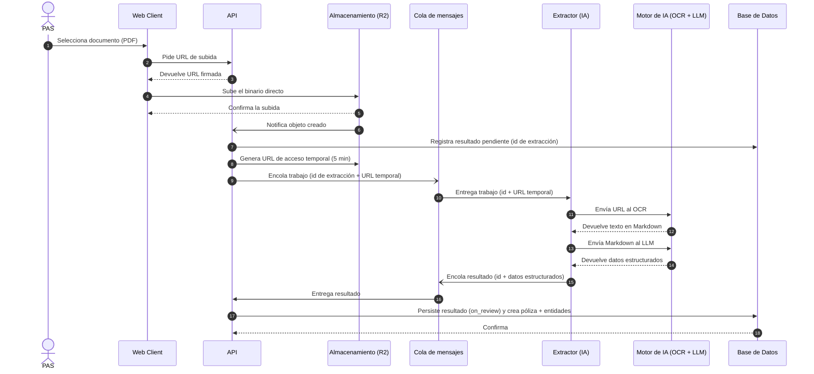
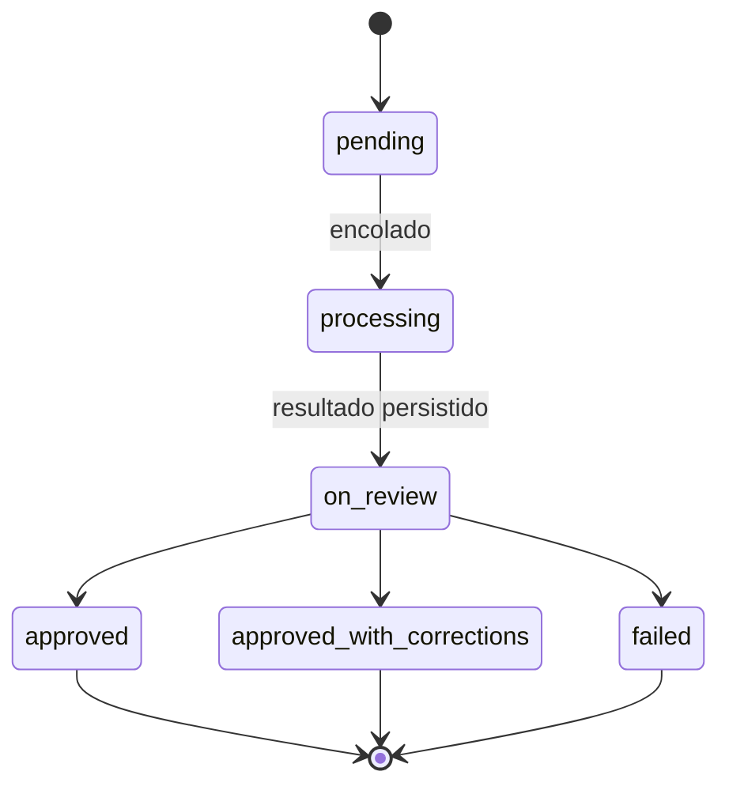

# Inteligencia Artificial

Pipeline de extracción de pólizas. El PAS sube un PDF, se extrae y normaliza con IA, y del resultado se crea la póliza.

## Componentes

| Componente | Rol |
|---|---|
| PAS | Productor que carga el documento |
| Web Client | Interfaz web |
| API | Recibe la subida, genera URLs temporales, orquesta el pipeline y persiste el dominio |
| Almacenamiento (R2) | Bucket de documentos |
| Cola de mensajes | Buffer asíncrono entre el API y el extractor |
| Extractor (IA) | Orquesta OCR y LLM sin descargar el binario |
| Motor de IA (OCR + LLM) | Mistral OCR (procesa URL y genera Markdown) + Workers AI (estructura a JSON) |
| Base de Datos | Persistencia del dominio |

## Ciclo de vida

1. **`pending`** — solo con el link. Aún no hay póliza.
2. **`processing`** — en cola, procesando con LLMs.
3. **`on_review`** — resultado persistido; acá se crea la póliza y entidades (cuotas, assets).
4. **`approved` / `approved_with_corrections`** — revisión humana.
5. **`failed`** — terminal tras reintentos.

## Revisión humana

Manual solo al inicio. Con 10+ pólizas de la misma compañía: auto-aprobadas, salvo 5% muestreado.

## Errores

Reintentos automáticos por la cola (at-least-once + idempotencia). Si queda incompleto, el PAS corrige en el cliente sobre la póliza creada. No se re-extrae.
