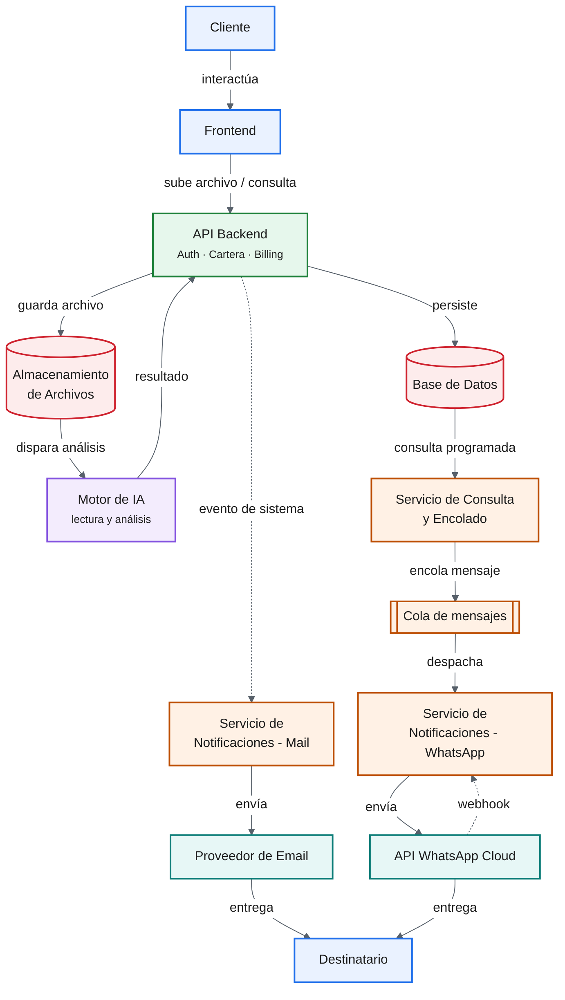

# Arquitectura De La Solucion

```mermaid
%%{init: {
  "theme": "base",
  "themeVariables": {
    "fontSize": "16px",
    "primaryColor": "#ffffff",
    "primaryBorderColor": "#1f6feb",
    "primaryTextColor": "#1c1c1c",
    "lineColor": "#57606a"
  },
  "flowchart": {
    "curve": "basis",
    "nodeSpacing": 30,
    "rankSpacing": 50,
    "wrappingWidth": 180
  }
} }%%
flowchart TD

    USER["Cliente"]
    FRONTEND["Frontend"]
    BACKEND["API Backend<br/><small>Auth · Cartera · Billing</small>"]
    BUCKET[("Almacenamiento<br/>de Archivos")]
    IA["Motor de IA<br/><small>lectura y análisis</small>"]
    DB[("Base de Datos")]
    NOTIF_MAIL["Servicio de<br/>Notificaciones - Mail"]
    QUERY_SVC["Servicio de Consulta<br/>y Encolado"]
    QUEUE[["Cola de mensajes"]]
    NOTIF_WA["Servicio de<br/>Notificaciones - WhatsApp"]
    MAIL_API["Proveedor de Email"]
    WA_API["API WhatsApp Cloud"]
    DESTINATARIO["Destinatario"]

    %% Flujo principal: carga y análisis
    USER -->|"interactúa"| FRONTEND
    FRONTEND -->|"sube archivo / consulta"| BACKEND
    BACKEND -->|"guarda archivo"| BUCKET
    BUCKET -->|"dispara análisis"| IA
    IA -->|"resultado"| BACKEND
    BACKEND -->|"persiste"| DB

    %% Flujo A: notificaciones de eventos del sistema (auth, billing) -> Mail
    BACKEND -.->|"evento de sistema"| NOTIF_MAIL
    NOTIF_MAIL -->|"envía"| MAIL_API
    MAIL_API -->|"entrega"| DESTINATARIO

    %% Flujo B: recordatorios programados -> consulta y encolado -> cola -> servicio de notificaciones WhatsApp
    DB -->|"consulta programada"| QUERY_SVC
    QUERY_SVC -->|"encola mensaje"| QUEUE
    QUEUE -->|"despacha"| NOTIF_WA
    NOTIF_WA -->|"envía"| WA_API
    WA_API -->|"entrega"| DESTINATARIO

    %% Flujo C: webhooks entrantes desde WhatsApp
    WA_API -.->|"webhook"| NOTIF_WA

    classDef client fill:#eaf2ff,stroke:#1f6feb,stroke-width:2px,color:#1c1c1c
    classDef backend fill:#e6f7ec,stroke:#1a7f37,stroke-width:2px,color:#1c1c1c
    classDef ai fill:#f3ecfd,stroke:#8250df,stroke-width:2px,color:#1c1c1c
    classDef storage fill:#fdecec,stroke:#cf222e,stroke-width:2px,color:#1c1c1c
    classDef notif fill:#fff1e5,stroke:#bc4c00,stroke-width:2px,color:#1c1c1c
    classDef external fill:#e7f7f6,stroke:#0d7d78,stroke-width:2px,color:#1c1c1c

    class USER,FRONTEND,DESTINATARIO client
    class BACKEND backend
    class IA ai
    class BUCKET,DB storage
    class NOTIF_MAIL,QUERY_SVC,QUEUE,NOTIF_WA notif
    class WA_API,MAIL_API external


```
