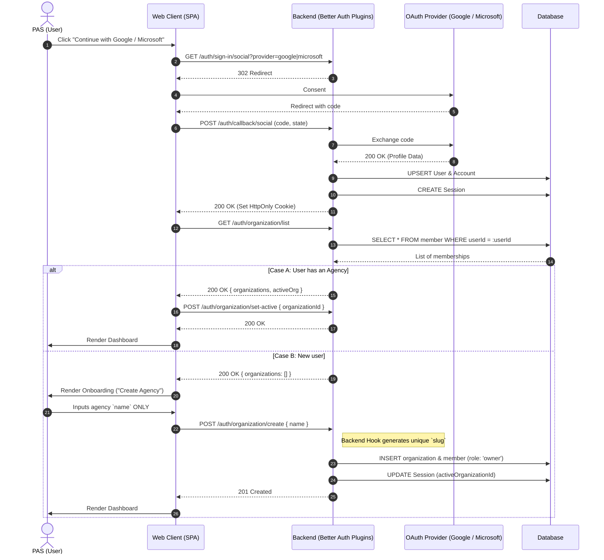

# Agency Onboarding Flow

## Technical Implementation

- **Core Dependency:** Endpoints and sessions are handled natively by Better Auth (`admin` and `organization` plugins).
- **Slug Generation:** Frontend SDK (`authClient.organization.create`) sends only the `name`. A Better Auth backend hook intercepts to auto-generate a unique `slug`.
- **UI Components:** Strictly use `shadcn` components from `src/packages/ui`.
- **Authentication:** OAuth only. Email/password inputs are hidden from the public client.

## Sequence Diagram

