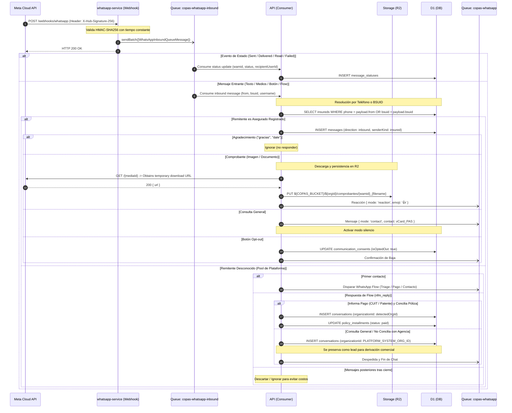

# WhatsApp Inbound Pipeline

Ingesta de webhooks de Meta por `whatsapp-service` y orquestación de dominio en `api`.

## Compatibilidad con Meta BSUID (Usernames)

Conforme a la actualización de Meta WhatsApp Business Platform:
- **BSUID (`user_id`)**: Meta introduce Business-Scoped User IDs (`US.123...`) para usuarios que adoptan nombres de usuario (`username`), ocultando el número telefónico a menos que haya interacción previa en los últimos 30 días.
- **Normalización**: `whatsapp-service` extrae tanto el teléfono (`from` / `wa_id`) como el `bsuid` (`contacts[].user_id`) y `username` opcional en [`WhatsAppInboundMessagePayload`](/src/packages/contracts/src/contexts/communications/whatsapp-inbound-message-queue-message.ts).
- **Resolución en `api`**: Si `from` es un teléfono, busca en `insureds.phone`. Si solo recibe BSUID, evalúa conversaciones previas con dicho identificador o solicita los datos mediante el WhatsApp Flow / botón `REQUEST_CONTACT_INFO`.

## Pipeline de Descarga y Almacenamiento de Multimedia

1. **Stateless en Worker**: `whatsapp-service` nunca descarga binarios; transporta el `media.id`, `mimeType` y `caption` a través de `copas-whatsapp-inbound`.
2. **Descarga en `api`**: El consumidor en `api` consulta `GET https://graph.facebook.com/v20.0/{media_id}` para obtener la URL efímera firmada y descarga los bytes.
3. **Estructura en R2 (`COPAS_BUCKET`)**:
   - Pólizas: `${COPAS_BUCKET}/${organizationId}/polizas/...`
   - Comprobantes de pago: `${COPAS_BUCKET}/${organizationId}/comprobantes/{wamid}_{filename}`

## Webhook Endpoints (`whatsapp-service`)

- **`GET /webhooks/whatsapp`**: Validación de challenge (`hub.mode === 'subscribe'`, `hub.verify_token` coincide con `env.META_VERIFY_TOKEN`).
- **`POST /webhooks/whatsapp`**: Validación de firma `X-Hub-Signature-256` con HMAC-SHA256 en tiempo constante, despacho atómico vía `env.WHATSAPP_INBOUND_QUEUE.sendBatch(...)` y respuesta HTTP 200 inmediata tras confirmación de cola.

## Ver también

- [Whatsapp Service](/docs/comunicaciones/whatsapp/servicio.md)
- [WhatsApp Service Worker](/src/docs/comunicaciones/whatsapp/service.md)
- [Triage de Inbound WhatsApp](/docs/comunicaciones/whatsapp/inbound_triage.md)
- [WhatsApp Outbound Pipeline](/src/docs/comunicaciones/whatsapp/outbound-pipeline.md)
- [Queues](/src/docs/arquitectura/infra/queues.md)
