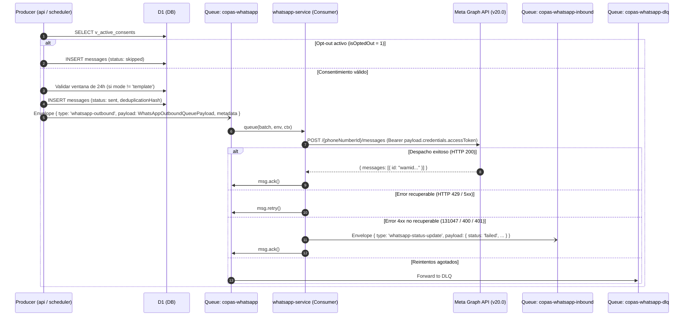

# WhatsApp Outbound Pipeline

Pipeline de despacho saliente hacia Meta Graph API.

## Modalidades de Mensaje Saliente

El contrato [`WhatsAppOutboundQueuePayload`](/src/packages/contracts/src/contexts/communications/whatsapp-outbound-queue-message.ts) soporta cinco modos:

- **`template`**: Plantillas HSM para recordatorios de vencimiento y primer contacto (soporta parámetros de texto, moneda, fecha/hora, imagen, documento y acciones de Flow en botones).
- **`free_form`**: Mensaje de texto libre (restringido a la ventana de 24h).
- **`reaction`**: Reacción emoji referenciando el `wamid` del mensaje entrante.
- **`contact`**: Envío de vCard con los datos de contacto del PAS.
- **`interactive`**: Mensajes interactivos directos (WhatsApp Flows estáticos y botones de respuesta rápida dentro de la ventana de 24h).

## Regla de la Ventana de 24 Horas de Meta (Customer Service Window)

Conforme a las políticas de Meta WhatsApp Business Platform:
- Los mensajes de tipo `free_form`, `contact`, `reaction` e `interactive` **únicamente** pueden enviarse dentro de las 24 horas posteriores al último mensaje entrante del destinatario.
- `api` y `scheduler` validan la vigencia de la ventana contra `conversations.lastMessageAt` / `messages.createdAt` antes de encolar; si la ventana expiró, solo se admite `mode: 'template'`.
- Si Meta rechaza un envío con código `131047` ("Re-engagement message"), `whatsapp-service` confirma con `msg.ack()` y notifica `status: 'failed'` a `copas-whatsapp-inbound` para que `api` asiente el fallo de forma definitiva.

## Resolución Unificada de Credenciales

Para evitar bifurcaciones en el worker, **las credenciales siempre las resuelve la plataforma (`api` / `scheduler`)**:
- `api` consulta `organization_integrations` (o las credenciales del pool de plataforma) e inyecta `credentials.accessToken` directamente en `payload.credentials`.
- `whatsapp-service` consume el payload y despacha de forma agnóstica sin lógica condicional de tokens.
- `to` acepta tanto número de teléfono en formato E.164 como BSUID de Meta.

## Ver también

- [Whatsapp Service](/docs/comunicaciones/whatsapp/servicio.md)
- [WhatsApp Service Worker](/src/docs/comunicaciones/whatsapp/service.md)
- [Triage de Inbound WhatsApp](/docs/comunicaciones/whatsapp/inbound_triage.md)
- [WhatsApp Inbound Pipeline](/src/docs/comunicaciones/whatsapp/inbound-pipeline.md)
- [Queues](/src/docs/arquitectura/infra/queues.md)
