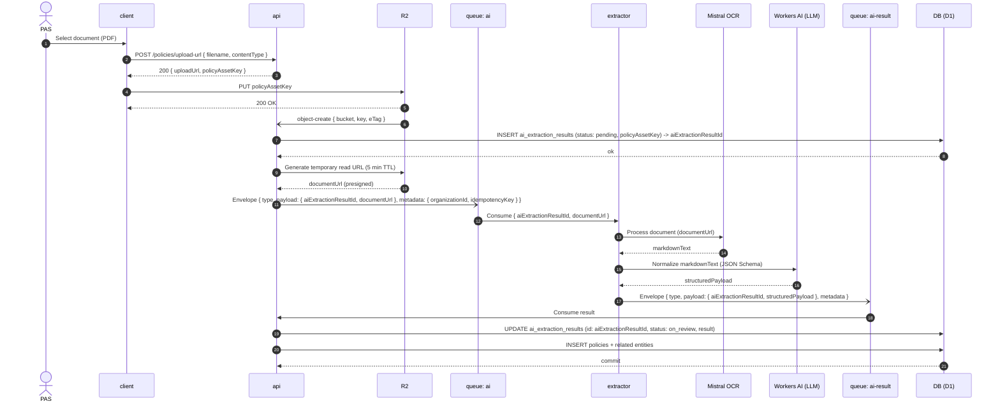

# AI Extraction Pipeline

## Rules

- Queues `ai` (api → extractor) and `ai-result` (extractor → api). See [Queues](/infra/queues.md).
- Messages use the [envelope](/infra/queues.md):
  - Queue `ai` carries `{ aiExtractionResultId, documentUrl }` where `documentUrl` is a signed temporary URL (5 min TTL) generated by `api`. Never binaries.
  - Queue `ai-result` carries `{ aiExtractionResultId, structuredPayload }`.
- `extractor` is a stateless adapter: it does not fetch from R2 directly; it delegates file retrieval to Mistral OCR via the temporary `documentUrl`, receives Markdown, and normalizes it using Workers AI (LLM).
- `api` is the only domain writer; `extractor` does not write to D1. See [Worker Boundaries](/infra/worker-boundaries.md).
- The policy is created only after the result arrives (`on_review`).

## Pending schema changes

The result is created before the policy exists. Not applied yet:

1. `ai_extraction_results.policyId` → nullable (currently `NOT NULL` + cascade).
2. `ai_extraction_results` → add column for the document link (e.g. `documentUrl`); `policies.documentUrl` does not exist yet at that point.
3. `policies.policyNumber` → nullable; adjust unique index `(organizationId, companyId, policyNumber)`.

## See also

- [Inteligencia Artificial](/docs/servicios/inteligencia_artificial.md)
- [Queues](/infra/queues.md)
- [Worker Boundaries](/infra/worker-boundaries.md)
