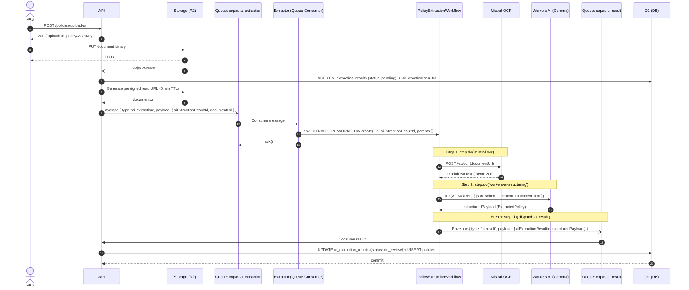

# AI Extraction Workflow

Durable execution pipeline for insurance policy extraction using Cloudflare Workflows (`cloudflare:workflows`).

## Workflow Steps

### 1. `mistral-ocr`
- **Action**: Sends `documentUrl` to Mistral OCR API (`mistral-ocr-latest`).
- **Output**: Full document in Markdown format (`markdownText`).
- **Retry Policy**: 3 retries, exponential backoff (base delay 10s), timeout 5m.
- **Memoization**: Result is durably persisted by Cloudflare Workflows. Downstream step retries never re-invoke Mistral OCR.

### 2. `workers-ai-structuring`
- **Action**: Invokes Cloudflare Workers AI model (`@cf/google/gemma-4-26b-a4b-it`) with `json_schema` constrained to `extractedPolicySchema`.
- **Input**: `markdownText` from Step 1.
- **Output**: Validated `ExtractedPolicy` JSON structure.
- **Retry Policy**: 3 retries, linear backoff (base delay 5s), timeout 2m.

### 3. `dispatch-ai-result`
- **Action**: Enqueues result message into `AI_RESULT_QUEUE` (`copas-ai-result`).
- **Payload**: `{ aiExtractionResultId, structuredPayload }`.
- **Metadata**: `{ organizationId, idempotencyKey: aiExtractionResultId, requestId }`.
- **Retry Policy**: 3 retries, constant backoff (5s), timeout 30s.

## Idempotency Rules

- **Deterministic Instance ID**: Workflows are initiated using `id = payload.aiExtractionResultId`.
- **At-Least-Once Delivery**: Duplicate queue deliveries from `copas-ai-extraction` resolve to the existing workflow instance via `create()` deduplication, preventing duplicate processing runs.
- **Result Idempotency**: `api` validates `aiExtractionResultId` prior to database writes in `policies.service.ts`.

## See also

- [AI Service](/docs/servicios/ai-service.md)
- [Queues](/src/docs/infra/queues.md)
- [Worker Boundaries](/src/docs/infra/worker-boundaries.md)
