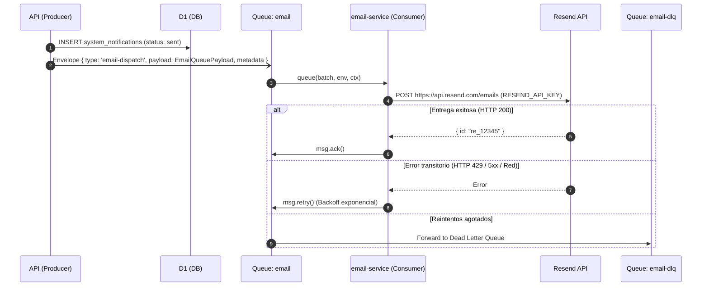

# Email Service Worker

Especificación de implementación técnica para el Cloudflare Worker `email-service`, adapter sin estado para el envío de correos electrónicos transaccionales vía Resend.

## Arquitectura de Despacho



## Configuración y Variables de Entorno

El worker `email-service` requiere en su entorno de ejecución (`wrangler.jsonc`):

| Variable / Binding | Tipo | Descripción |
|---|---|---|
| `EMAIL_QUEUE` | Queue Consumer | Consumidor vinculado a la cola `email` de Cloudflare |
| `RESEND_API_KEY` | Secret | Token API de Resend para autenticación de peticiones HTTP |
| `DEFAULT_FROM_EMAIL` | Variable | Dirección predeterminada del remitente (ej. `notificaciones@copas.app`) |

## Contrato de Mensaje (`@copas/contracts`)

El worker procesa mensajes que cumplen con el contrato atómico [`EmailQueueMessage`](/src/packages/contracts/src/contexts/communications/email-queue-message.ts):

```ts
type EmailQueuePayload = {
  notificationId: string
  recipientEmail: string
  subject: string
  html: string
  text?: string
  from?: string
  replyTo?: string
  tags?: Record<string, string>
}
```

## Reglas de Confiabilidad y Reintentos

1. **Pre-renderizado en API**: `email-service` no realiza interpolación de plantillas ni consultas a base de datos. Recibe `html` y `text` ya generados.
2. **Idempotencia**: Si el mensaje contiene `metadata.idempotencyKey`, se envía el header `Idempotency-Key` en la llamada a Resend para evitar envíos duplicados ante reintentos de la cola.
3. **Manejo de Errores**:
   - Códigos HTTP 4xx no recuperables (ej. 422 destinatario inválido): se descarta con `msg.ack()` para no bloquear la cola.
   - Errores de disponibilidad (HTTP 429, 500, 502, timeouts): se dispara `msg.retry()` permitiendo reintento con backoff exponencial.
   - Dead Letter Queue (`email-dlq`): captura mensajes que exceden el límite configurado de reintentos (5 intentos).

## Ver también

- [Concepto: Email Service](/docs/servicios/email_service.md)
- [Queues](/src/docs/infra/queues.md)
- [Worker Boundaries](/src/docs/infra/worker-boundaries.md)
