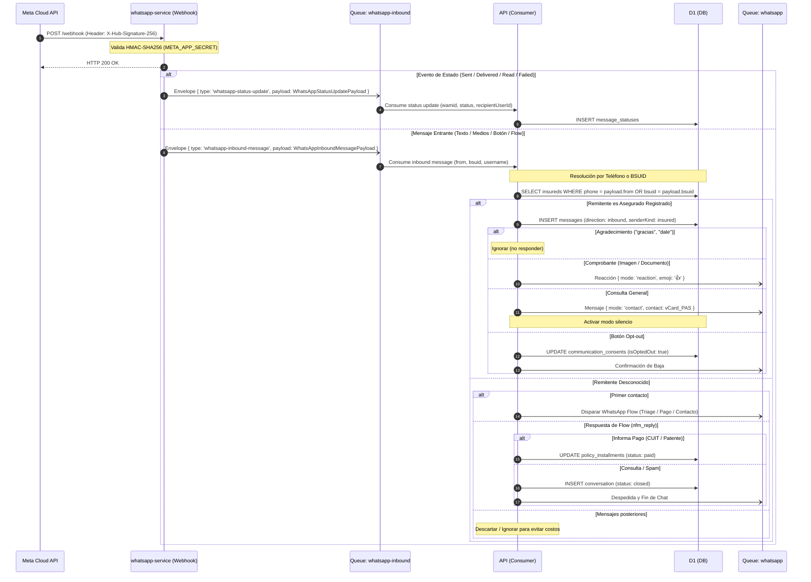

# WhatsApp Inbound Pipeline

Ingesta de webhooks de Meta por `whatsapp-service` y orquestación de dominio en `api`.

## Compatibilidad con Meta BSUID (Usernames)

Conforme a la actualización de Meta WhatsApp Business Platform:
- **BSUID (`user_id`)**: Meta introduce Business-Scoped User IDs (`US.123...`) para usuarios que adoptan nombres de usuario (`username`), ocultando el número telefónico a menos que haya interacción previa en los últimos 30 días.
- **Normalización**: `whatsapp-service` extrae tanto el teléfono (`from` / `wa_id`) como el `bsuid` (`contacts[].user_id`) y `username` opcional en [`WhatsAppInboundMessagePayload`](/src/packages/contracts/src/contexts/communications/whatsapp-inbound-message-queue-message.ts).
- **Resolución en `api`**: Si `from` es un teléfono, busca en `insureds.phone`. Si solo recibe BSUID, evalúa conversaciones previas con dicho identificador o solicita los datos mediante el WhatsApp Flow / botón `REQUEST_CONTACT_INFO`.

## Webhook Endpoints (`whatsapp-service`)

- **`GET /webhook`**: Validación de challenge (`hub.mode === 'subscribe'`, `hub.verify_token`).
- **`POST /webhook`**: Validación de firma `X-Hub-Signature-256` con `timingSafeEqual`, respuesta HTTP 200 inmediata y despacho normalizado a `whatsapp-inbound`.

## Ver también

- [Whatsapp Service](/docs/servicios/whatsapp_service.md)
- [Triage de Inbound WhatsApp](/docs/decisiones/whatsapp_inbound_triage.md)
- [WhatsApp Outbound Pipeline](/src/docs/infra/whatsapp-outbound-pipeline.md)
- [Queues](/src/docs/infra/queues.md)
