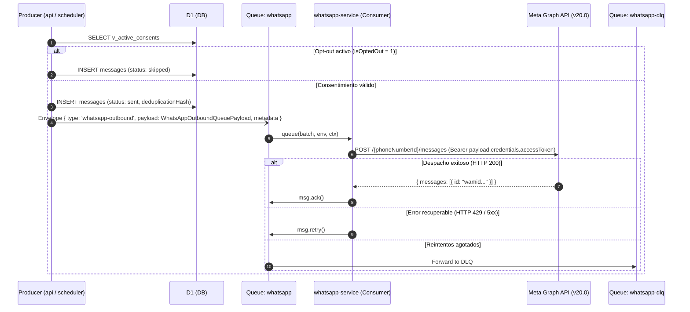

# WhatsApp Outbound Pipeline

Pipeline de despacho saliente hacia Meta Graph API.

## Modalidades de Mensaje Saliente

El contrato [`WhatsAppOutboundQueuePayload`](/src/packages/contracts/src/contexts/communications/whatsapp-outbound-queue-message.ts) soporta cuatro modos:

- **`template`**: Plantillas HSM para recordatorios de vencimiento y primer contacto.
- **`free_form`**: Mensaje de texto libre.
- **`reaction`**: Reacción emoji referenciando el `wamid` del comprobante entrante.
- **`contact`**: Envío de vCard con los datos de contacto del PAS.

## Resolución Unificada de Credenciales

Para evitar bifurcaciones en el worker, **las credenciales siempre las resuelve la plataforma (`api` / `scheduler`)**:
- `api` consulta `organization_integrations` (o las credenciales del pool de plataforma) e inyecta `credentials.accessToken` directamente en `payload.credentials`.
- `whatsapp-service` consume el payload y despacha de forma agnóstica sin lógica condicional de tokens.
- `to` acepta tanto número de teléfono en formato E.164 como BSUID de Meta.

## Ver también

- [Whatsapp Service](/docs/servicios/whatsapp_service.md)
- [Triage de Inbound WhatsApp](/docs/decisiones/whatsapp_inbound_triage.md)
- [WhatsApp Inbound Pipeline](/src/docs/infra/whatsapp-inbound-pipeline.md)
- [Queues](/src/docs/infra/queues.md)
